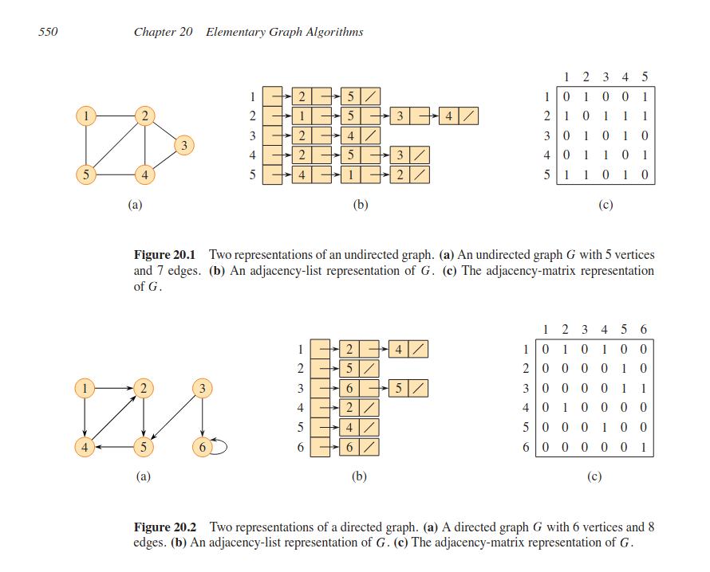

# Homework 10
Let G = (V, E) be a directed graph in which the vertices are labeled from 1 to |V|. For each vertex u, find the vertex v that has the smallest label among all the vertices reachable from u (including u itself).

    Nodes: 1, 2, 3, 4, 5, 6
    Edges:

        1 → 2
        1 → 4
        2 → 5
        3 → 5
        3 → 6
        4 → 2
        5 → 4
        6 → 6 (self-loop)

For example, for the above graph, the result should be (in the format u:v) 1:1, 2:2, 3:2, 4:2, 5:2, 6:6.

There are two candidate solutions:

* Call a revised version of DFS on every vertex u to find the smallest reachable vertex v.

* Construct the transpose of G, GT, then call a revised version of DFS starting at the vertices v in increasing order and marks all reachable vertices u that have not be marked yet as u:v, until all the vertices are labeled.

## Tasks:

1. For each of the two solutions, compare the efficiency of using an adjacency matrix and an adjacency list to represent the graph. Derive the T(n) time complexity by solving the recurrence relation for each without using Big O notations.
2. Write the most efficient algorithm for each of the 2 solutions.
3. Implement the most efficient algorithm in python based on the analysis of the best algorithm in task 1.
4. Extensively test the algorithm with sample graphs stored in text files for all significant edge cases.

